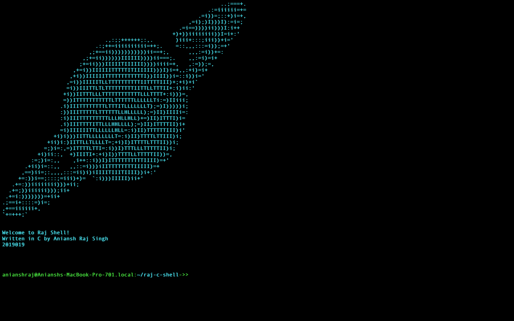

# Raj C Shell
A simple bash-like shell written in C along with a few external commands, with an option to use either the custom commands or the existing programs on the system (from $PATH)

<br>

The shell is a simple exercise in trying to learn about how shell programs such as bash work. This is **NOT** meant to be a viable daily-use shell, only a proof of concept! Feel free to go through the code!



## Installation

```
git clone https://github.com/aniansh19019/raj-c-shell
cd raj-c-shell
make
```

## Usage

In the `raj-c-shell` directory,

To use your system's binaries:

```
./raj_shell
```

<br>

To use the custom binaries written in C:

```
./raj_shell 0
```
